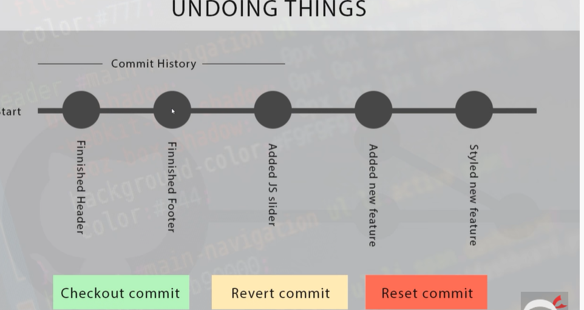

# Git
Git step by step

1. Initial Setup in Local :
  
  * Setting up username and email in local :
     
     1. git config --global user.name annmaryvinod

     2. git config --global user.email annmary@gmail.com

 * Checking :
     
     1. git config user.name

     2. git config user.email

2. Some Basic Command Lines and their usage :

  * Change Directory "cd .." : to go back to the adjacent parent directory.

  * Change Directory "cd Documents" : to dive into 'Documents' directory.

  *  List : " ls " / " dir " : to list the contents of the current directory.
       
       Note: "dir" is for Windows.
       " ls " also works for Windows.

  * Make Directory : " mkdir Playground " : creates a new directory named Playground.

  * Creating a file in mac or cmd(windows) : " touch index.html " : creates an index.html file.

  * Remove a file : " rm index.html " : deletes the index.html file

  *  Remove a directory : " rmdir Playground " : deletes the directory named Playground.      

3. Some real GIT commands :

   * Initialising a git repo in the local :

       command :   " git init "

       this can be used to initialise or create a new repo in an empty or non empty folder in the local 

   * Checking the status of a repo ( to find the staging,committed files etc) :

      command : " git status "

      this shows the unstaged files (untracked files),committed files etc.

   * To stage a file :

      command : " git add index.html"    

      index.html is added to the staging area (can be checked with " git status ")

   * To unstage a staged file :

     command : " git rm --cached index.html "

     removes index.html from the staging area (can be checked using " git status ")   

   * To add multiple files to the staging area :

     command : " git add . "

   * Commiting :

     command : git commit -m "fixed a bug in the header"    

  * Commit History :

    1. To see all info :
    
    command : " git log "   

    2. To get a condensed form (crisp):

    command : " git log --oneline "

  * Undoing Things :

   

   1. checkout : read-only command. It can take us back to the code at a particular commit

        " Eg : Boss wants to see the code at the end of the second commit (just to see)"

          * command to get to the specified commit :  "git checkout 4dc777b "

          * command to get back on the top :  "git checkout master "

   

              Note : 4dc777b refers to the id of the second commit. This can be obtained from the commit history

   2. revert : Undo a commit 

          * command : " git revert 4dc777b "
             
             Now a screen pops up asking for a commit msg requirement.
             Press Shift + colon.
             Then type "wq"

         * " git log " shows a new commit of revert

   3. reset : permanent deletion. Reset to a specified commit. All commits after the specified commit will be deleted.

      * command   : " git reset 4dc777b --hard "

      resets to the 4dc777b commit         
    

 

